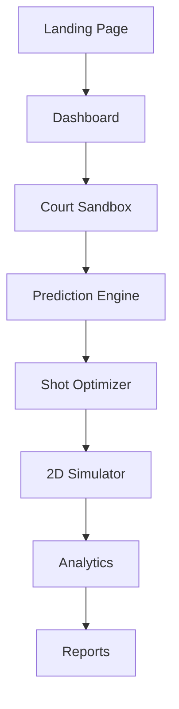
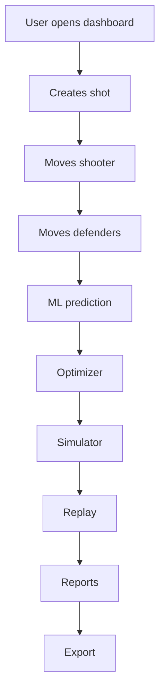
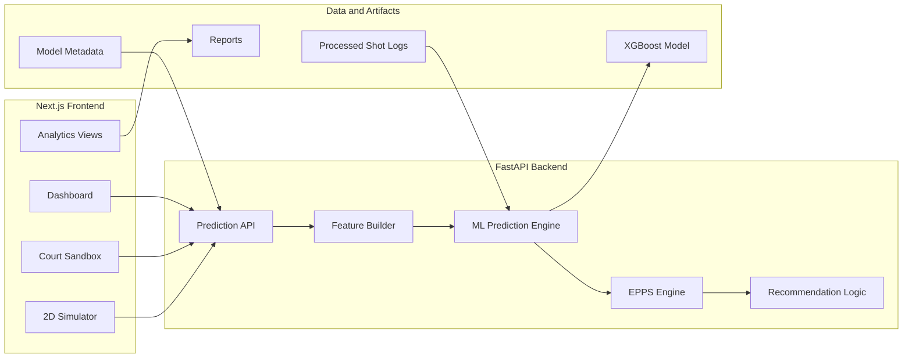
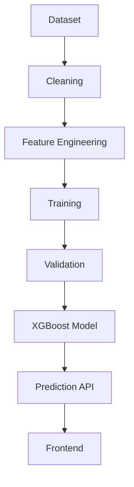
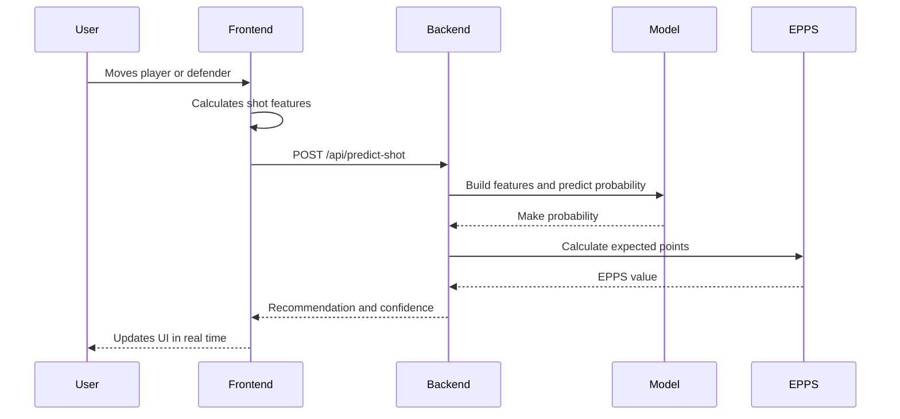

# ShotOptix - AI Powered Basketball Shot Optimization Engine

[](https://nextjs.org/)
[](https://fastapi.tiangolo.com/)
[](https://xgboost.ai/)
[](https://www.python.org/)
[](https://www.typescriptlang.org/)
[](#license)

ShotOptix is a final year thesis project that combines machine learning, basketball analytics, and interactive simulation to optimize shot selection using Expected Points Per Shot.

---

## Hero Banner


> Image placeholder: `docs/images/banner.png`

---

## Table of Contents

- [Overview](#overview)
- [Key Features](#key-features)
- [Screenshots](#screenshots)
- [Complete Workflow](#complete-workflow)
- [User Flow](#user-flow)
- [System Architecture](#system-architecture)
- [Folder Structure](#folder-structure)
- [Technologies Used](#technologies-used)
- [Core Modules](#core-modules)
- [Machine Learning Pipeline](#machine-learning-pipeline)
- [EPPS Engine](#epps-engine)
- [Prediction Pipeline](#prediction-pipeline)
- [Court Sandbox](#court-sandbox)
- [Optimizer](#optimizer)
- [2D Simulator](#2d-simulator)
- [Analytics](#analytics)
- [Evaluation](#evaluation)
- [API Endpoints](#api-endpoints)
- [Installation](#installation)
- [Future Improvements](#future-improvements)
- [Project Timeline](#project-timeline)
- [References](#references)
- [License](#license)
- [Author](#author)
- [Acknowledgements](#acknowledgements)

---

## Overview

ShotOptix is an AI powered basketball shot optimization engine designed to help players, coaches, and analysts understand shot quality beyond basic field goal percentage. Instead of only asking whether a shot went in, ShotOptix evaluates the context around a shot: distance, angle, defender pressure, shot zone, shot value, body mechanics, and game situation.

Traditional FG% treats every attempt the same. A made corner three, a contested mid range jumper, and an open layup are all reduced to make or miss. Expected Points Per Shot (EPPS) is more useful because it combines shot probability with shot value:

```text
EPPS = Make Probability x Shot Value
```

This means a 36% three pointer can be more valuable than a 48% two pointer, because the model evaluates expected points instead of raw accuracy alone.

ShotOptix combines:

- Interactive simulation
- Machine learning prediction
- XGBoost classification
- Basketball analytics
- Body mechanics editing
- Data visualization
- Shot optimization

---

## Key Features

| Feature | Description |
| --- | --- |
| Dashboard | Central workspace for project insights, model status, and user navigation. |
| Interactive Court Sandbox | SVG basketball court with draggable shooter and defender controls. |
| Real Time Shot Simulation | Live shot probability, EPPS, and recommendation updates. |
| Machine Learning Prediction | FastAPI prediction endpoint powered by a trained XGBoost model. |
| Expected Points Per Shot Engine | Converts make probability and shot value into basketball decision value. |
| Shot Optimizer | Compares nearby shot candidates and recommends stronger locations. |
| 2D Stickman Simulator | Visual mechanics simulator for body posture and shot release. |
| Body Mechanics Editor | Adjustable pose and release parameters for shooting form analysis. |
| Replay System | Review simulated motion and shot mechanics over time. |
| Analytics Dashboard | Explore shot trends, pressure impact, probability, and EPPS patterns. |
| Heatmaps | Visual shot quality and optimization maps across the court. |
| Evaluation Dashboard | Model metrics, feature importance, and validation results. |
| Reports | Research-ready summaries for findings and model behavior. |
| Settings | Runtime preferences and application configuration. |
| Responsive Design | Works across desktop and smaller screens. |
| FastAPI Backend | Python API for health checks, prediction, and model diagnostics. |
| XGBoost Model | Tree-based model trained for basketball shot make probability. |
| Synthetic Demo Data | Demo-friendly data flow for repeatable thesis presentation scenarios. |

---

## Screenshots

| Screen | Placeholder |
| --- | --- |
| Landing Page | `docs/images/screenshots/landing-page.png` |
| Dashboard | `docs/images/screenshots/dashboard.png` |
| Court Sandbox | `docs/images/screenshots/court-sandbox.png` |
| Prediction | `docs/images/screenshots/prediction.png` |
| Optimizer | `docs/images/screenshots/optimizer.png` |
| 2D Simulator | `docs/images/screenshots/2d-simulator.png` |
| Heatmap | `docs/images/screenshots/heatmap.png` |
| Evaluation | `docs/images/screenshots/evaluation.png` |
| Reports | `docs/images/screenshots/reports.png` |
| Model Info | `docs/images/screenshots/model-info.png` |
| Settings | `docs/images/screenshots/settings.png` |

---

## Complete Workflow



---

## User Flow



---

## System Architecture

ShotOptix is split into a modern TypeScript frontend and a Python machine learning backend. The frontend handles interaction, visualization, court geometry, analytics dashboards, and simulation. The FastAPI backend handles prediction requests, transforms shot context into model features, runs the XGBoost model, calculates EPPS, and returns recommendations.



---

## Folder Structure

```text
shot-optimization-engine/
|-- backend/
|   |-- app/
|   |   |-- core/
|   |   |-- ml/
|   |   |-- schemas/
|   |   |-- services/
|   |   `-- utils/
|   |-- trained_models/
|   `-- requirements.txt
|-- data/
|   |-- raw/
|   `-- processed/
|-- docs/
|-- frontend/
|   |-- app/
|   |-- components/
|   |-- hooks/
|   |-- lib/
|   |-- store/
|   |-- types/
|   `-- utils/
|-- notebooks/
|-- scripts/
`-- README.md
```

| Folder | Purpose |
| --- | --- |
| `frontend/` | Next.js application, court UI, dashboards, simulator, analytics, and client state. |
| `backend/` | FastAPI service, prediction schemas, ML model loading, feature building, and EPPS logic. |
| `data/` | Raw and processed datasets used for cleaning, training, and evaluation. |
| `docs/` | Project notes, screenshots, diagrams, and thesis documentation assets. |
| `notebooks/` | Data exploration, preparation, training, and evaluation notebooks. |
| `scripts/` | Reproducible data cleaning, normalization, training, and evaluation scripts. |

---

## Technologies Used

| Area | Technology |
| --- | --- |
| Frontend | Next.js 16, React 19, TypeScript |
| Backend | FastAPI, Pydantic, Uvicorn |
| Machine Learning | Python, scikit-learn, XGBoost, pandas, joblib |
| Visualization | Recharts, SVG court rendering, custom analytics components |
| Styling | Tailwind CSS, project design tokens |
| Charts | Recharts, custom chart wrappers |
| Deployment | Vercel-ready frontend, ASGI-compatible backend |
| State Management | Zustand, React hooks |

---

## Core Modules

| Module | Description |
| --- | --- |
| Dashboard | Main workspace for overview metrics, model status, and navigation. |
| Court Sandbox | Interactive court for positioning shooter and defenders. |
| Prediction | Converts shot context into make probability, EPPS, quality, and recommendation. |
| Optimizer | Searches nearby shot locations and compares expected value. |
| 2D Simulator | Shows shooting form, release motion, mechanics feedback, and replay. |
| Analytics | Visualizes probability, pressure, zone, mechanics, and EPPS trends. |
| Evaluation | Displays model metrics including accuracy, precision, recall, ROC AUC, and feature importance. |
| Heatmap | Maps shot value and optimal zones across the court. |
| Reports | Summarizes model behavior and thesis-ready analysis. |
| Settings | Controls user preferences and runtime behavior. |
| Model Info | Explains the active ML model, feature list, fallback behavior, and metadata. |
| About | Presents project scope, thesis motivation, and system summary. |

---

## Machine Learning Pipeline

The ML pipeline transforms basketball shot logs into a model-ready dataset, trains an XGBoost classifier, evaluates the model, and exposes predictions through the FastAPI backend.



The current model artifacts are stored in:

```text
backend/trained_models/shot_xgboost_model.pkl
backend/trained_models/model_metadata.json
```

---

## EPPS Engine

Expected Points Per Shot measures the expected scoring value of a shot:

```text
EPPS = Probability x Shot Value
```

ShotOptix uses EPPS to compare different shot decisions. A shot with lower make probability can still be optimal if its point value is higher and the probability remains strong enough.

Factors that contribute to EPPS include:

- Distance from basket
- Defender pressure
- Shot zone
- Shot type
- Defender position
- Shot value
- Angle and location
- Game clock and shot clock context

---

## Prediction Pipeline



Step by step:

1. User moves the shooter or defender.
2. Frontend calculates shot context features.
3. Backend receives the prediction request.
4. XGBoost predicts make probability.
5. EPPS is calculated from probability and shot value.
6. Recommendation text is generated.
7. Prediction result is returned to the frontend.

---

## Court Sandbox

The Court Sandbox is the main interactive experimentation surface. It includes:

- Interactive SVG court
- Draggable shooter
- Draggable defenders
- Pressure calculation
- Distance calculation
- Shot zone detection
- Snap assist
- Analytics overlays
- Live probability and EPPS statistics

---

## Optimizer

The optimizer generates nearby candidate locations around the current shooter position. Each candidate is evaluated with the same prediction and EPPS logic, then compared against the current shot. The app can recommend a better shot when a nearby position produces higher expected value or lower pressure.

Optimization considers:

- Candidate distance from the current shooter
- Shot value changes between twos and threes
- Defender spacing
- Zone classification
- Predicted make probability
- EPPS improvement

---

## 2D Simulator

The 2D simulator focuses on shot mechanics and visual feedback. It includes:

- Pose editor
- Joint manipulation
- Jump animation
- Ball release visualization
- Mechanics scoring
- Replay system
- Coach-style feedback

This module helps connect shot location analytics with body mechanics, making the system useful for both tactical and technical shooting decisions.

---

## Analytics

ShotOptix includes analytics views for interpreting model behavior and basketball trends:

- Charts for probability, EPPS, and shot quality
- Court heatmaps
- EPPS trends
- Probability trends
- Mechanics trends
- Pressure analytics
- Zone analytics
- Optimizer comparisons

---

## Evaluation

The evaluation workflow tracks model quality and thesis-ready ML reporting metrics:

- Accuracy
- Precision
- Recall
- F1 score
- ROC AUC
- Confusion matrix
- Feature importance
- Cross validation

Evaluation artifacts are stored under `data/processed/` and `backend/trained_models/`.

---

## API Endpoints

| Method | Endpoint | Description |
| --- | --- | --- |
| `GET` | `/` | Confirms the backend service is running. |
| `GET` | `/api/health` | Returns backend health status. |
| `POST` | `/api/predict-shot` | Predicts make probability, EPPS, shot quality, confidence, and recommendation. |
| `GET` | `/api/model-info` | Returns model diagnostics, feature list, target column, and fallback behavior. |

### Example Prediction Request

```json
{
  "shooter_x": 120,
  "shooter_y": 340,
  "defender_x": 160,
  "defender_y": 320,
  "shot_distance": 23.5,
  "shot_angle": 42,
  "shot_zone": "Three Point",
  "defender_distance": 3.2,
  "pressure_level": "Tight",
  "shot_value": 3,
  "period": 4,
  "shot_clock": 12.0,
  "dribbles": 1,
  "touch_time": 2.5,
  "loc_x": 1.5,
  "loc_y": 30.5,
  "game_clock_seconds": 626,
  "is_home": 0,
  "player_height_inches": 75,
  "player_weight": 190,
  "player_season_exp": 6,
  "player_draft_number": 7,
  "defender_height_wo_shoes_in": 78,
  "defender_wingspan_in": 82,
  "defender_wingspan_diff_in": 4,
  "defender_d_dpm": 0.8,
  "action_type": "Pullup Jump shot",
  "shot_type": "3PT Field Goal",
  "position_group": "G"
}
```

### Example Prediction Response

```json
{
  "make_probability": 0.38,
  "make_probability_percent": "38.0%",
  "shot_value": 3,
  "epps": 1.14,
  "shot_quality": "Good",
  "recommendation": "Good value shot, but create more space.",
  "confidence": "Medium",
  "prediction_source": "ml_model"
}
```

### Example Model Info Response

```json
{
  "model_loaded": true,
  "model_name": "ShotOptix XGBoost Shot Model",
  "model_type": "XGBoostClassifier",
  "phase": "Phase 4",
  "target_column": "shot_made",
  "features_used": ["shot_distance", "shot_angle", "defender_distance"],
  "prediction_fallback": "rule_based"
}
```

---

## Installation

### Requirements

- Node.js 20+
- npm
- Python 3.10+
- Git

### Frontend Setup

```powershell
cd frontend
npm install
npm run dev
```

The frontend runs at:

```text
http://localhost:3000
```

### Backend Setup

```powershell
cd backend
python -m venv venv
.\venv\Scripts\Activate.ps1
pip install -r requirements.txt
uvicorn app.main:app --reload
```

The backend runs at:

```text
http://localhost:8000
```

### Environment Variables

Create a backend `.env` file if custom configuration is needed:

```env
APP_NAME=ShotOptix Backend
APP_VERSION=1.0.0
ALLOWED_ORIGINS=http://localhost:3000
```

### Rebuild Data and Model Artifacts

```powershell
python scripts/clean_shot_logs.py
python scripts/normalize_shotoptix_training_data.py
python scripts/run_ml_experiments.py --sample-size 350000 --require-action-type --cv-folds 3
python scripts/train_and_save_shotoptix_model.py --require-action-type --sample-size 1200000
python scripts/evaluate_shotoptix_model.py
```

Experiment notes and model comparison results are documented in
`docs/ml-improvement-experiments.md`.

### Collaborative stacking (push toward 70%)

Train XGBoost + LightGBM + CatBoost + MLP together locally:

```powershell
python scripts/train_stacking_ensemble.py --require-action-type --sample-size 1500000 --cv-folds 3 --promote-if-better
```

Or run the GPU collaborative notebook in Google Colab:

1. Upload the project (or `data/processed/shotoptix_ml_training.csv` + `backend/`) to Drive
2. Open `notebooks/04_deep_learning_colab.ipynb`
3. Runtime → GPU
4. Run all cells — it trains tree models + deep MLP and stacks them
5. Download `colab_ensemble_bundle.joblib` into `backend/trained_models/`

---

## Future Improvements

- Hyperparameter / feature refresh cycles after richer tracking data arrives
- Real NBA tracking data
- 3D skeletal animation
- Pose estimation
- Computer vision powered form detection
- Video upload and shot breakdown
- Player comparison
- Live game integration
- Mobile application
- Cloud deployment
- Coach/team dashboards
- Personalized training recommendations

---

## Project Timeline

| Phase | Focus | Status |
| --- | --- | --- |
| Phase 0 | Landing page and initial project structure | Complete |
| Phase 1 | Data collection and preparation | Complete |
| Phase 2 | Interactive court sandbox | Complete |
| Phase 3 | FastAPI backend and rule-based prediction | Complete |
| Phase 4 | Machine learning pipeline and XGBoost model | Complete |
| Phase 5 | EPPS engine and simulator integration | Complete |
| Phase 6 | UX polish, analytics, and workspace refinement | Complete |

---

## References

- Basketball analytics and expected value research
- NBA shot chart and shot log datasets
- XGBoost documentation
- FastAPI documentation
- Next.js documentation
- scikit-learn model evaluation documentation

> Replace these placeholders with final thesis citations before submission.

---

## License

This project is licensed under the MIT License.

---

## Author

| Field | Details |
| --- | --- |
| Developer | Rabin |
| GitHub | [@Rabin935](https://github.com/Rabin935) |
| Email | `your.email@example.com` |
| University | `Your University Name` |
| Supervisor | `Supervisor Name` |
| Version | `1.0.0` |

---

## Acknowledgements

Thanks to the open-source communities behind Next.js, React, FastAPI, XGBoost, scikit-learn, pandas, Recharts, Tailwind CSS, and the basketball analytics research community. This project was built as a final year thesis to explore how AI-assisted decision support can improve basketball shot selection and player development.
